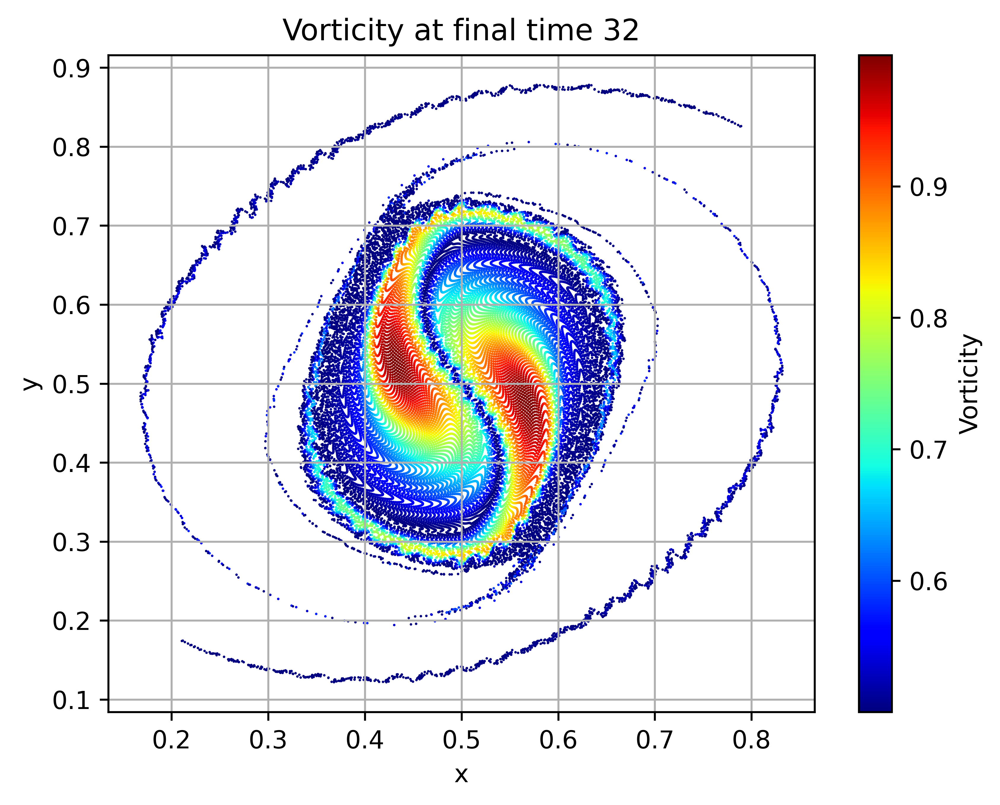

# Point vortex library
- <strong>Autodifferentiable<strong>
- <strong>CPU-GPU tested -jax[cpu] - jax[cuda12]<strong>
- <strong>Works on nvidia cluster and locally on different macs<strong>

# To run:
Attain a copy of the code and run it e.g. : 
- <strong>-python3 example_0.py<strong>

### The below timesteppers are differentiable to optimise solution trajectories. (Ensemble 4Dvar)
- <strong>-python3 example_1.py<strong>
- <strong>-python3 example_2.py<strong>
noting that the entire solution trajectory is saved to local memory. 

### The below timestepers are differentiable to optimise the final condition.
- <strong>-python3 example_3.py<strong>
- <strong>-python3 example_4.py<strong>

### Dependencies: 
jax, matplotlib, numpy.

### Example zero solves
$$\boldsymbol{x}(\boldsymbol{X}, t)=\boldsymbol{x}(\boldsymbol{X}, 0)+\int_0^t \boldsymbol{u}(\boldsymbol{x}(\boldsymbol{X}, s), s) d s; \quad \boldsymbol{x}(\boldsymbol{X}, 0)=\boldsymbol{X}
$$

### Example one solves: 
$$\boldsymbol{x}(\boldsymbol{X}, t)=\boldsymbol{x}(\boldsymbol{X}, 0)+\int_0^t \boldsymbol{u}(\boldsymbol{x}(\boldsymbol{X}, s), s) d s+\sum_{p=1}^P \int_0^t \theta_p \boldsymbol{\xi}_p(\boldsymbol{x}(\boldsymbol{X}, s)) \circ d B^p(s) ; \quad \boldsymbol{x}(\boldsymbol{X}, 0)=\boldsymbol{X}
$$

### Examples two solves: 
$$\boldsymbol{x}(\boldsymbol{X}, t)=\boldsymbol{x}(\boldsymbol{X}, 0)+\int_0^t \boldsymbol{u}(\boldsymbol{x}(\boldsymbol{X}, s), s) d s+\sum_{p=1}^P \int_0^t \theta_p \boldsymbol{\xi}_p(\boldsymbol{x}(\boldsymbol{X}, s)) \circ d B^p(s) +  \int_0^t \nu d W(s) ; \quad \boldsymbol{x}(\boldsymbol{X}, 0)=\boldsymbol{X}
$$

### Example three solves: 
$$\boldsymbol{x}(\boldsymbol{X}, t)=\boldsymbol{x}(\boldsymbol{X}, 0)+\int_0^t \boldsymbol{u}(\boldsymbol{x}(\boldsymbol{X}, s), s) d s+\sum_{p=1}^P \int_0^t \theta_p \boldsymbol{\xi}_p(\boldsymbol{x}(\boldsymbol{X}, s)) \circ d B^p(s) ; \quad \boldsymbol{x}(\boldsymbol{X}, 0)=\boldsymbol{X}
$$

### Examples four solves: 
$$\boldsymbol{x}(\boldsymbol{X}, t)=\boldsymbol{x}(\boldsymbol{X}, 0)+\int_0^t \boldsymbol{u}(\boldsymbol{x}(\boldsymbol{X}, s), s) d s+\sum_{p=1}^P \int_0^t \theta_p \boldsymbol{\xi}_p(\boldsymbol{x}(\boldsymbol{X}, s)) \circ d B^p(s) +  \int_0^t \nu d W(s) ; \quad \boldsymbol{x}(\boldsymbol{X}, 0)=\boldsymbol{X}
$$

# References 
This code is a usable subset of the code developed for the paper,

###https://arxiv.org/pdf/2405.00640

@article{woodfield2024stochastic,
  title={Stochastic fluids with transport noise: Approximating diffusion from data using SVD and ensemble forecast back-propagation},
  author={Woodfield, James},
  journal={arXiv preprint arXiv:2405.00640},
  year={2024}
}

### Numerical Approach:
Let each point belong in a initial mesh $X_{i}\in \wedge_0$, 

Each "point" vortex has strength $\Gamma_i$, denoted in this code by the i-th position of the vector carr.

The point vortex anzats 
$$
\omega(x)=\sum_i \Gamma_i \delta (x-x_i),
$$
and the regularised Biot-Savart kernel of [7]
$$
\left(u^\delta(x, y), v^\delta(x, y)\right)^T=\sum_{i \in \wedge_0} \frac{\Gamma_i\left(-\left(y-y_i\right),\left(x-x_i\right)\right)^T}{2 \pi\left\|\boldsymbol{x}-\boldsymbol{x}_i\right\|_2^2}\left(1-L_p\left(\left\|\boldsymbol{x}-\boldsymbol{x}_i\right\|_2^2 / \delta^2\right) \exp \left(-\left\|\boldsymbol{x}-\boldsymbol{x}_i\right\|_2^2 / \delta^2\right)\right)
$$
closes the system as a finite-dimensional system,
$$
 \boldsymbol{x}_{\boldsymbol{i}}(t)=\boldsymbol{x}_{\boldsymbol{i}}(0)+\int_0^t \boldsymbol{u}^\delta\left(\boldsymbol{x}_{\boldsymbol{i}}(s), s\right) d s+\sum_{p=1}^P \int_0^t \theta_p \boldsymbol{\xi}_p\left(\boldsymbol{x}_{\boldsymbol{i}}(s)\right) \circ d W_s^p, \quad \forall i \in \wedge_0 
$$
where $L_p$ is the p-th order Laguerre polynomial 

This code is based upon: lecture notes provided by JOHN METHVEN in a summer school, and 

# Kernel convergence in the deterministic setting,
[7] = J Thomas Beale and Andrew Majda. High order accurate vortex methods with explicit velocity kernels. Journal of Computational Physics, 58(2):188–208, 1985

This scheme (in the deterministic setting) has been shown to have the property that if $\delta=h^q$ for $q \in(0,1)$, the order of convergence to the solution of the Euler Equation is given by $O\left(h^{(2 p+2) q}\right)$ see [7].

# Stochastic scheme temporal consistency,

To deal with the stochastic Stratonovich term, we discretise in time with the stochastic generalisation of the SSP33 scheme of Shu and Osher, where the forward Euler scheme is replaced with Euler Maruyama scheme in the Shu Osher representation. This time-stepping is weak order 1, strong order 0.5, as can be found by Taylor expanding or as a subcase of the work by Ruemelin[40].

[40] = W Rüemelin. Numerical treatment of stochastic differential equations. SIAM Journal on Numerical Analysis,
19(3):604–613, 1982.

The paper: 
Lévy areas, Wong Zakai anomalies in diffusive limits of Deterministic Lagrangian Multi-Time Dynamics. 

Studies some of the effects of higher order stochastic integration for point vortex systems. 
